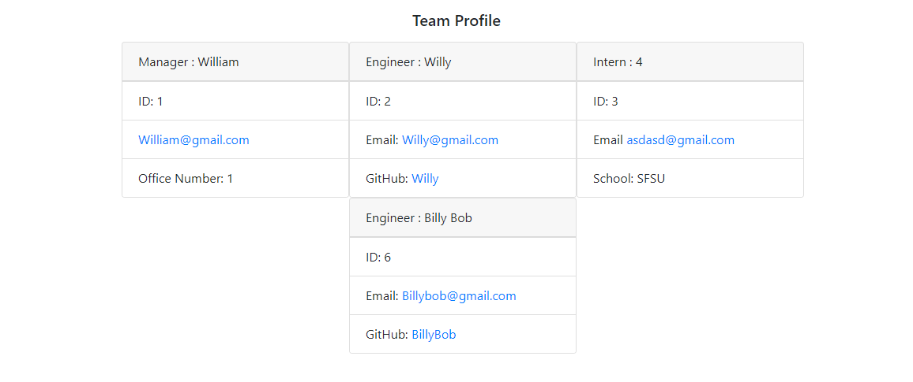
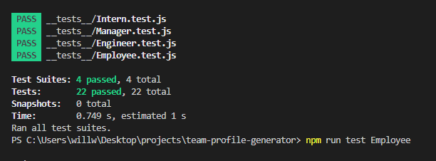
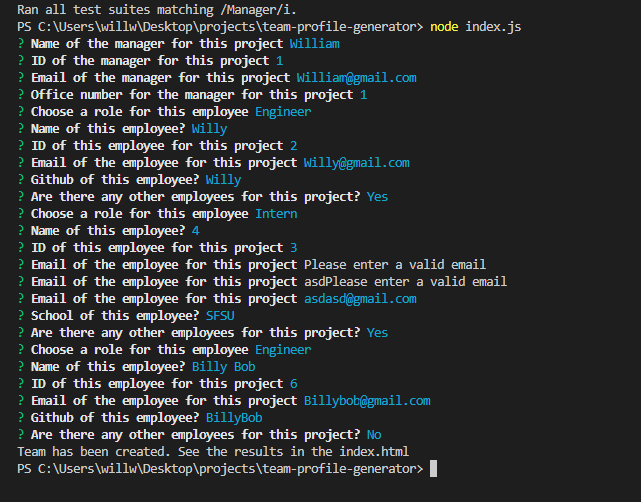

# Team Profile Generator

## Purpose
This is an app that takes user input to create a Team Profile. It has jest test functions and uses the inquirer package to get user data to fill out the team cards. Below are screenshots and a video demonstration of the command console running tests, as well as an example team being created and deployed.

## Built With
* HTML
* Javascript
* CSS
* Inquirer
* Jest

## Video Demonstration Link
https://drive.google.com/file/d/1TMMOS-ejY9b-m6GRWzM5wXcpQxq1nEZ1/view

## Screenshot

